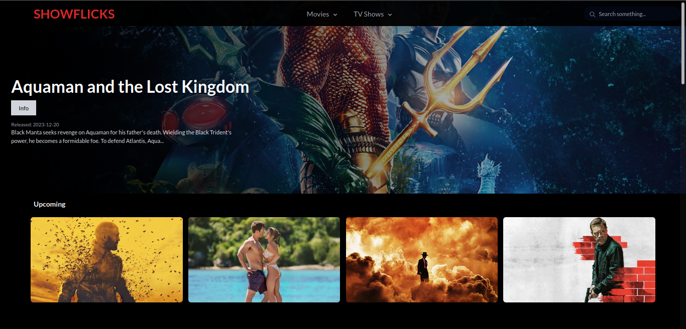
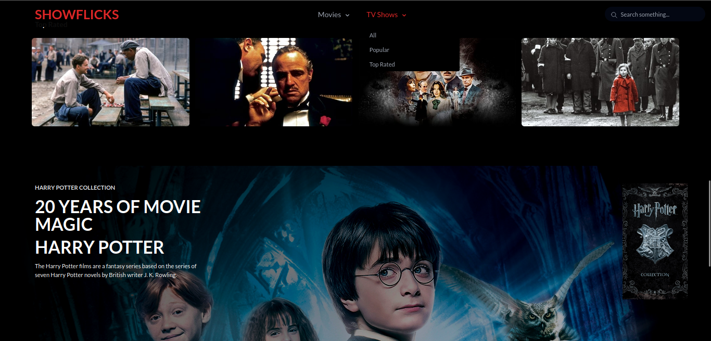

# 🎥🎬 Show Flicks

> © Desarrollado por Valentin Chianese
## Descripción

Show Flicks es una aplicación web que te permite consultar la información y trailers de miles de películas y series.

## Stack
- React
- TypeScript
- Vite
- Tailwind CSS
- API de TMDB

## Funcionalidades

Las características principales del proyecto son:

- **Información:** Consulta la sinopsis, fecha de estreno, género, calificación y más de películas y series.

- **Filtros:** Encuentra contenido por "estrenos", "mejor rankeada", "género" y más.

- **Buscador:** Encuentra rápidamente el contenido que te interesa.

## Aspectos destacados

- Implementación de Infinite Scroll para una experiencia de usuario fluida.

- Optimización del consumo de la API de TMDB.

- Uso de componentes reutilizables en React.

- Ruteo con React

- Implementación de useParams y searchParams para la gestión de filtros y búsquedas.

## Captura de pantalla

## Sitio web
En este link se encuentra desplegada la aplicación web, puedes probarla sin problemas.
<a href="https://show-flicks.netlify.app/">Show Flicks - App web</a>

## Créditos

Desarrollado por [Valentin Chianese](https://github.com/ImLevan).
